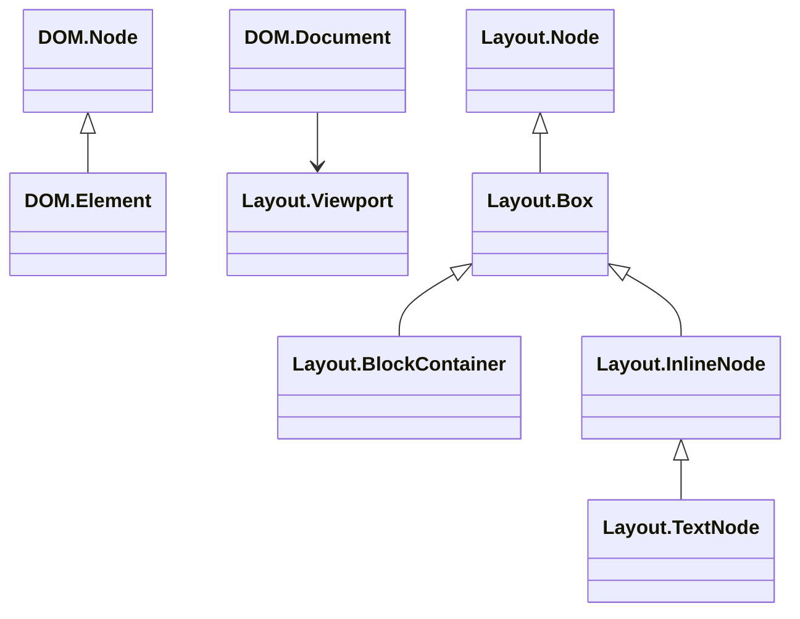
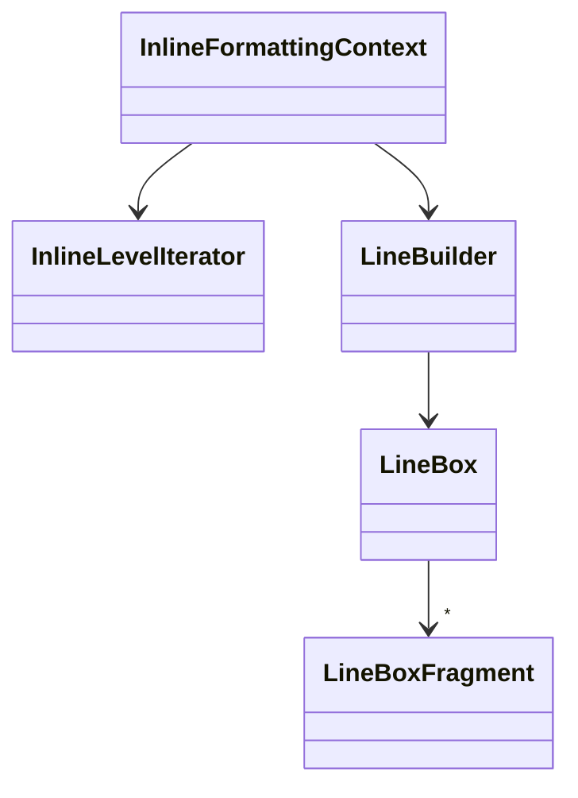
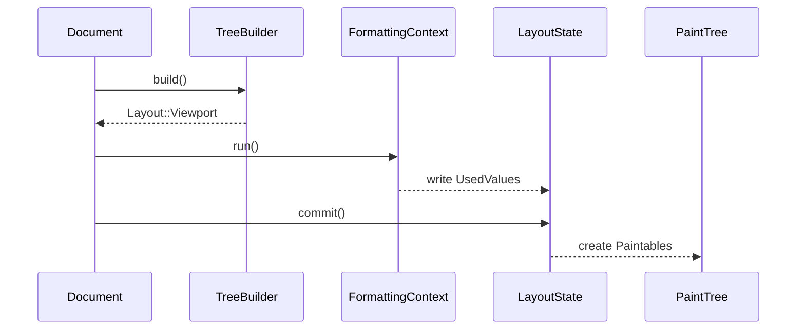

# LibWeb Implementation Details: From DOM to Render

This document provides a detailed overview of how the LibWeb engine converts DOM
nodes into rendered pixels. It expands on the high level description in
`Documentation/LibWebFromLoadingToPainting.md` and references the relevant code
found inside `Libraries/LibWeb`.

## Building the layout tree

After style computation finishes, LibWeb combines the DOM tree with the computed
style information to create the **layout tree**. This is done by
`Layout::TreeBuilder::build()` and is described in the CSS specifications as the
*box tree*.

```
Document::update_layout()
    └─ Layout::TreeBuilder::build(Document)
            → returns Layout::Viewport (layout tree root)
```

There is not a strict 1:1 mapping between DOM nodes and layout nodes. Elements
with `display:none` do not create layout nodes. Additional fix‑ups are performed
when building the tree:

- Inline children with block siblings are wrapped in anonymous block boxes to
  satisfy the block/inline invariant.
- Stand‑alone table pieces (rows, cells, etc.) are wrapped in anonymous table
  boxes so that the resulting layout tree always forms a full table.
- List items generate a marker box representing the bullet if needed.



The layout tree nodes are subclasses of `Layout::Node` such as `BlockContainer`,
`InlineNode`, and `TextNode`. The root of the tree is always a
`Layout::Viewport` representing the initial containing block.

## Layout

Layout begins at the initial containing block (ICB) and is driven by a set of
**formatting contexts**. Each formatting context corresponds to a rendering
model defined by the CSS specifications:

- **Block Formatting Context** ([CSS Display §9](https://www.w3.org/TR/css-display/#block-formatting-context))
- **Inline Formatting Context** ([CSS 2 §9.4](https://www.w3.org/TR/CSS22/visuren.html#inline-formatting))
- **Table Formatting Context** ([CSS Tables §2](https://www.w3.org/TR/css-tables-3/#table-layout))
- **Flex Formatting Context** ([CSS Flexbox §9](https://www.w3.org/TR/css-flexbox-1/#layout-algorithm))
- **SVG Formatting Context** (LibWeb specific helper for embedded SVG)

The layout procedure is recursive. `Document::update_layout()` creates a
`Layout::LayoutState` and instantiates a `BlockFormattingContext` for the ICB.
That context in turn creates additional formatting contexts as needed while
walking the layout tree.

### Block-level layout

A `BlockFormattingContext` lays out its block-level children one by one along the
block axis. Adjacent margins may collapse. Floating boxes are positioned by first
laying them out normally, then shifting them left or right until they either hit
a side or stack with another float. The formatting context keeps track of floats
on both sides so that later block and inline content can avoid them.

### Inline-level layout

If a block container contains inline-level children, the BFC delegates to an
`InlineFormattingContext` (IFC). The IFC is responsible for producing **line
boxes** which hold `LineBoxFragment` objects for each piece of inline content.
This is orchestrated by three main classes:

- `InlineFormattingContext` – high level driver
- `InlineLevelIterator` – iterates over inline items, respecting whitespace and
  text runs
- `LineBuilder` – accumulates items into line boxes and handles line breaking

The `LineBuilder` decides when to call `break_line()` based on the remaining
available width and whether a forced break was encountered.



### Layout state

Each formatting context writes the resulting metrics into a `Layout::LayoutState`.
`LayoutState::UsedValues` objects store content sizes, margins, borders, padding
and the line boxes for each layout node. When layout completes, the state is
committed with `LayoutState::commit()` which builds the paint tree.

### Key data structures

Below is a high level description of the most important classes involved in layout and what data they store.

**`Layout::Node`** – base class for all nodes in the layout tree. Each node keeps a pointer to the DOM node it represents, a list of `Paintable` objects for the painting phase and a pointer to its containing block.

```
GC::Ref<DOM::Node> m_dom_node;
PaintableList m_paintable;
GC::Ptr<Box> m_containing_block;
```

**`Layout::Box`** – extends `NodeWithStyleAndBoxModelMetrics` and holds box‑model state and intrinsic sizes. Box nodes remember natural dimensions used for replaced elements and lazily computed `IntrinsicSizes` for min/max content calculations.

```
Optional<CSSPixels> m_natural_width;
Optional<CSSPixels> m_natural_height;
Optional<CSSPixelFraction> m_natural_aspect_ratio;
OwnPtr<IntrinsicSizes> mutable m_cached_intrinsic_sizes;
```

**`LineBox`** – represents a single line of inline layout. It owns a vector of `LineBoxFragment` objects and tracks the line’s length, height and baseline.

```
Vector<LineBoxFragment> m_fragments;
CSSPixels m_inline_length { 0 };
CSSPixels m_block_length { 0 };
CSSPixels m_baseline { 0 };
```

**`LineBoxFragment`** – smallest unit of inline layout. Stores references to the owning layout node, the text range it covers, offsets relative to the line box and the shaped glyph run if the fragment is text.

```
GC::Ref<Node const> m_layout_node;
int m_start { 0 };
int m_length { 0 };
CSSPixels m_inline_offset;
CSSPixels m_block_offset;
CSSPixels m_inline_length;
CSSPixels m_block_length;
RefPtr<Gfx::GlyphRun> m_glyph_run;
```

**`LayoutState::UsedValues`** – layout results for a particular node. Besides content size, it stores margins, borders, padding and line boxes. It also holds optional data such as floating descendants and computed SVG transforms.

```
CSSPixels margin_left { 0 };
CSSPixels border_left { 0 };
CSSPixels padding_left { 0 };
Vector<LineBox> line_boxes;
HashTable<GC::Ptr<Box const>> m_floating_descendants;
Optional<Painting::SVGGraphicsPaintable::ComputedTransforms> m_computed_svg_transforms;
```

## Paintable and the paint tree

Committing the `LayoutState` produces a parallel **paint tree** made of
`Painting::Paintable` objects. Each visible layout node owns one or more
paintables. The paint tree is used for both painting and hit testing.



Painting happens according to the stacking context tree as described in
[CSS2 §E](https://www.w3.org/TR/CSS22/zindex.html). For each stacking context,
paint phases proceed from backgrounds to foregrounds.

## Summary

LibWeb constructs a layout tree using `Layout::TreeBuilder` and performs layout
recursively via formatting contexts. Inline layout is handled by
`InlineFormattingContext`, `InlineLevelIterator`, and `LineBuilder`, producing
`LineBoxFragment` records. Final metrics are stored in `LayoutState` and committed
into the paint tree for rendering and hit testing.
